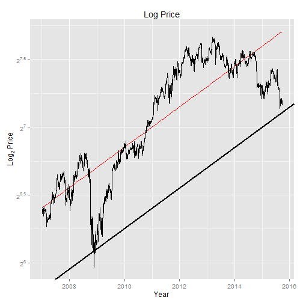

## CAGR and Stock Inflation concept

Stock price in general increase over time if the fundamental is right that is the business is profitable.
This means that the stock price growth can be modeld as the fundamental stock inflation.
This would result in the stock prices that can be modeled as $price = 2^t$.

Stock price (TA) then is a technical reflection of the fundamental (FA) and the sentiments and psychology of the market (PA). 

                                      TA = PA + FA

We created or assumed a model where the CAGR trend based on the linear regression is at the neutral or fair growth trend of the FA , which is the fundamental growth of the company. Any residual or error from the neutral CAGR then is considered as part of the PA or market price gyration due to fear or greed. 

The right price to have high probability gain would then be to identify the lowest points , given a line that is still parallel to the neutral regression line.


--- .class #id 

## Facilitating the price discovery via  simple shiny app and positive CAGR

The shiny app created is a simple visualization of the app to identify the price low enough based on historical trend and leverage on the linear regression model to do the estimation and use trend line offset.
This requires the application of the logarithm to the stock price to get  a straight line fit as far as possible particularly for  positive CAGR stock.


---
## Linear regression model on log Price.
The stock data is obtained from yahoo and consist of the following variables in time series dataset.

```
##             open  high   low close      vol price year mth
## 2015-09-23 15.60 15.85 15.58 15.72 77240300 15.72 2015   9
## 2015-09-24 15.54 15.62 15.40 15.55 97752800 15.55 2015   9
## 2015-09-25 15.88 16.02 15.81 15.89 88260000 15.89 2015   9
```


a linear regression line is added and anothe offset LM line parallel to the LM line (indicated as black line) is created and allow the line to  shift by offset value. 
The idea is to have the line shifted to touch the lowest price points at least two of them to idenity the lowest support line.

--- 
## Plot illustrating the LM and offset LM lines
 


---

## The End


